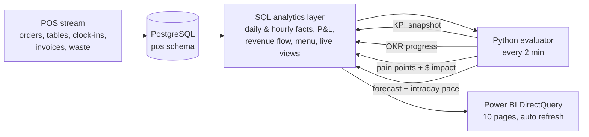

# Business guide: KPIs, OKRs, pain points and revenue flow

This guide explains what the ForkCast numbers mean for Harbor & Hearth Kitchen, a fictional six-store South Florida chain, and how each one is produced. Figures below are from the live database on 26 Sep 2026.

## How the pieces fit



- **SQL** does the counting: what happened, per store, per day and hour.
- **Python** does the judging: is it good, is it on plan, what is wrong, what is it worth, and what comes next.
- **Power BI** shows both, reading straight from Postgres.

## 1. Revenue flow: where each $100 of sales goes

Trailing 12 months, chain level:

| Flow | Per $100 | What drives it |
|---|---:|---|
| Dine-in → net sales | $85 | Seats × utilization × turns × spend per cover |
| Takeout + delivery → net sales | $15 | Off-premise orders; delivery keeps growing |
| Net sales → food & beverage | $33 | Menu mix, vendor prices (protein +9% in Jun 2025), waste, portioning |
| Net sales → labor | $33 | Scheduling vs demand; Florida minimum wage steps each 30 Sep |
| Net sales → rent | $7 | Fixed, so it shrinks as a share when sales grow |
| Net sales → delivery commissions, card fees, other opex | $11 | 22% commission on delivery, ~2.6% on cards, utilities, marketing |
| **Net sales → four-wall EBITDA** | **$17** | What the store keeps before corporate overhead |

The same flows are stored month by month in `analytics.revenue_flow` (source → target → amount), which feeds the Sankey visual. The Power BI waterfall steps from net sales down to EBITDA for any store and month.

**The KPI tree** links the flow to the drivers a manager can act on:

```
Net sales  = covers × sales per cover
covers     = seats × seat utilization × open hours / dwell  (+ off-premise)
EBITDA     = net sales − prime cost (food & bev + labor) − occupancy − other opex
prime cost = the part a GM controls week to week → the number to manage
```

## 2. KPIs

There are 21 KPIs in `realtime/definitions.py`. Every KPI is computed from summed daily columns, so it works for a day, a week, a month or a year, and for one store or the whole chain. The evaluator writes each KPI × period (today, yesterday, week to date, month to date, last 28 days, last 365 days) × scope (chain + six stores) to `analytics.kpi_snapshot`. Each row carries its same-period-last-year value (aligned to the same weekday, −364 days) and a status.

| Area | KPIs | Target (good / watch) |
|---|---|---|
| Revenue | Net sales, covers, average check, sales per cover, off-premise share | vs last year: ≥ +2% good, ≥ −3% watch |
| Floor | Seat utilization, RevPASH, table turns, average dwell | 22% / 17%, $9.50 / $8.00, 2.2 / 1.8, ≤ 75 / 85 min |
| Guest experience | Walk-away rate, large-party walk-away rate, average wait | ≤ 1% / 2%, ≤ 15% / 25%, ≤ 8 / 12 min |
| Cost of goods | Food cost %, food cost variance vs recipe, beverage cost %, waste % | ≤ 33% / 35%, ≤ 3 / 4 pts, ≤ 24% / 27%, ≤ 4.5% / 6% |
| Labor | Labor %, sales per labor hour | ≤ 32% / 35%, ≥ $55 / $50 |
| Profit | Prime cost %, discount rate, delivery commissions % | ≤ 65% / 68%, ≤ 2% / 3.5%, ≤ 2% / 3% |

Two design choices matter:

- **Cost KPIs need at least 4 weeks.** Food is bought on invoices, not per plate. Daily purchases are accrued evenly over the days each delivery covers (Monday 3 days, Thursday 4, weekly 7), but the evaluator still reports food-cost KPIs only for 28-day and longer windows.
- **Growth KPIs are judged against last year, not a fixed target.** That makes a slow September comparable to last September instead of to a busy March.

## 3. OKRs: Fall-Holiday 2026 cycle (1 Sep – 31 Dec)

Improvement key results are measured against **the same dates last year**, so the cycle isn't penalized for starting in the off-season. Progress runs from 0% (at the baseline) to 100% (target met). Status is on track at ≥ 70%, at risk at 30–70%, and off track below that. The sales key result is paced against last year's calendar instead: 16% of the target sales done by 25 September is on pace, because last year had done 16% by the same date.

| Objective | Key result | Now | Status |
|---|---|---|---|
| **O1 Grow profitable revenue** | KR1.1 Net sales +8% over last year's Sep–Dec | $2.15M of $13.22M, on last year's pace | On track |
| | KR1.2 RevPASH +6% vs last year | $7.99 vs $7.13 (target $7.56) | On track |
| | KR1.3 Halve large-party walk-aways | 20.9% vs 19.0% (target 9.5%) | Off track |
| **O2 Protect margins** | KR2.1 Prime cost −1.5 pts vs last year | 65.4% vs 67.6% (target 66.1%) | On track |
| | KR2.2 Food cost within 3 pts of recipe | 2.8 pts | On track |
| | KR2.3 Waste ≤ 4% of food purchases | 5.0% | Off track |
| **O3 Staff smarter, seat every guest** | KR3.1 Sales per labor hour +5% | $53.12 vs $50.32 (target $52.84) | On track |
| | KR3.2 Mizner Park labor −3 pts | 37.3% vs 38.9% (target 35.9%) | At risk |
| | KR3.3 Average wait ≤ 8 min | 8.3 min | At risk |

Why these key results: O1 separates price (RevPASH) from traffic, and names the one traffic leak the data proves (large parties). O2 targets the two ways margin disappears, food and waste. O3 targets the one store whose labor is structurally out of line, plus a guest-facing measure so labor cuts don't show up as longer waits.

The table updates every evaluator run. `analytics.okr_history` keeps one row per day, so Power BI can chart progress over the cycle.

## 4. Pain points

The evaluator runs 14 detectors every 2 minutes and writes what it finds to `analytics.alerts`. Each alert carries evidence, a recommended action and an **estimated annual profit impact**. An alert keeps its first-seen time while the problem persists, and is marked resolved when it clears.

| Detector | Fires when | How $ impact is sized |
|---|---|---|
| Sales pacing (live) | Settled hours ≥ 12% behind the expected curve (average of the last 4 same weekdays, scaled to today's forecast) | Day's sales at risk |
| Walk-aways (live) | ≥ 6 parties left today | Lost covers × spend per cover |
| Long waits (live) | Average wait > 12 min | none |
| Over / understaffed (live) | Last hour's covers per staff hour < 0.6× or > 1.6× the store's usual for that hour | none |
| Labor efficiency | Labor % > target + 2 pts and SPLH < 93% of the peer median (28 days) | Excess hours × cost per hour, annualized |
| Food cost variance | Actual food cost > recipe cost + 4 pts | Gap above 3 pts × food sales |
| Waste | Waste > 6% and > 1.5× the peer median | Gap to peer median × food purchases |
| Large-party loss | > 20% of 5–6 guest parties walk away | 40% recaptured × covers × spend per cover × 34% flow-through |
| Prime cost | > 68% | Not sized (roll-up of the labor and food alerts) |
| Discounts | Comps > 3.5% of gross | Gap to 2% |
| Delivery fees | Commissions > 3% of sales | 20% of orders moved to own ordering (22% → 5% fee) |
| Sales decline | Last 7 days < −5% vs the same week last year | Gap × 52 × flow-through |
| Menu margin | Popular mains with below-average margin (90 days) | +$1 price, 3% unit loss |

**Open now (critical first):**

| Severity | Store | Pain point | $ / year |
|---|---|---|---:|
| Critical | Mizner Park | Labor 37.7% of sales; scheduling above demand | $262k |
| Critical | Atlantic Ave | Food waste 9.3% of purchases | $58k |
| Critical | Las Olas | 34% of 5–6 guest parties walk away | $52k |
| Critical | Mizner Park, Atlantic Ave | Prime cost above 68% | (roll-up) |
| Warning | Atlantic Ave | Food cost 4.3 pts above recipe | $42k |
| Warning | Clematis, Harbourside, Atlantic Ave | 23–27% of large parties walk away | $97k |
| Info | All six stores | Best-selling mains earn below-average margin | $183k |

## 5. Forecast and pacing

- **Daily forecast:** a log-linear regression per store with trend, day of week, annual seasonality, holidays, the menu price step and a new-store ramp. Brickell borrows seasonality from the mature stores. P10 and P90 come from a block bootstrap. It runs once per business day. Every past forecast is kept, so `analytics.forecast_vs_actual` scores each day against the forecast made before it.
- **Intraday pace:** today's expected sales by hour, from the last four same weekdays scaled to today's forecast. Only hours whose checks have had time to close are compared, so seated parties don't trigger false alarms.

## Interview talking points

1. **Architecture:** "The POS feed lands in Postgres. SQL builds the facts, and Python evaluates them against targets, OKRs and baselines, then writes the results back. Power BI reads everything in DirectQuery, so the report and the code share one definition of each KPI."
2. **A metric decision:** "Food cost from invoices is lumpy, so I accrue each delivery over the days it covers, and only report food cost on 4-week windows."
3. **An OKR decision:** "Improvement key results are measured against the same dates last year, so a September start isn't graded against a March peak."
4. **A pain-point decision:** "Every alert carries evidence, an action and an annual dollar impact, and the prime-cost roll-up isn't sized, so the total doesn't double-count."
5. **A modeling decision:** "The newest store borrows seasonality from its sister stores because it has one season of history."
